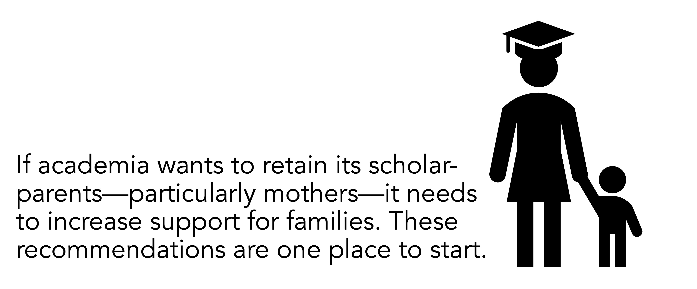

I became a mom in the final few minutes of 2021 and entered the happiest, and hardest, phase of my life.

I made the decision to breastfeed with eyes wide open. I understood its benefits for me, for my baby, for our bond, for my bank account, and for the environment. I also knew there would be (potentially insurmountable) challenges, and I would need all the help I could get.

We got off to a rocky start. My newborn was nearly hospitalized after losing too much weight after birth. On the advice of her doctor, we tried &mdash; several times &mdash; offering formula. Each time ended in projectile vomit, and lots of tears.

Mercifully, blessedly, thankfully, my university-sponsored health plan covered unlimited visits with a lactation consultant. With two weeks of daily visits, we successfully established nursing. There were later bumps in the road (oversupply, then undersupply, then plugged ducts), but it no longer felt like a life-or-death situation. 

Then, when my daughter was six weeks old, the first formula recall notice was issued. The [situation worsened throughout 2022](https://www.nytimes.com/2022/05/10/us/baby-formula-shortage.html). While the news coverage has slowed, on-the-ground shortage remains. Despite actively looking in every store I enter, I still have not seen formula on the shelves.

My daughter is now 11 months old and has not needed formula supplementation, thanks in large part due to the support of my spouse, healthcare workers, and daycare providers. It is a deep privilege to exclusively breastfeed my daughter, a challenge and a bond that I am daily grateful for. Soon, I will no longer be my child's primary source of nutrition, though we may continue nursing. 

As I approach the end of my pumping journey, I felt compelled to write a long-form primer on breastfeeding, for people who have never been a nursing parent. Before giving you one-off recommendations, here are the things you need to know about breastfeeding and pumping.

**1. Lactation is maintained in a supply-demand relationship.**

- Supply drops when there isn't sufficient demand. This requires that milk is removed (by a baby or by a breast pump) with high frequency. A rule of thumb is *every three hours*.

**2. Milk needs to be removed from the breasts with high frequency.**

- If milk is not removed with high frequency, there is an immediate risk to the nursing parent ranging from engorgement and plugged ducts to mastitis.

**3. Breast pumps are not a perfect substitute for direct breastfeeding.**

- Pumping without contact with your child can be stressful and psychologically taxing. Even a couple of days of travel while exclusively pumping can cause a significant drop in your supply.

**4. Human milk (or formula) is the primary source of nutrition for the first YEAR of life.**

- The [American Academy of Pediatrics](https://publications.aap.org/pediatrics/article-abstract/150/1/e2022057988/188347/Policy-Statement-Breastfeeding-and-the-Use-of/) recommends exclusive nursing for the first six months of life. That means no formula supplementation. 
- Solids can be introduced at six months, but human milk should remain the primary source of nutrition until twelve months. 
- Only after twelve months can cow's milk be introduced. 
- The AAP further recommends that nursing should continue through age 2 years.

**5. The safe storage of human milk is logistically complex for working parents.**

- Pumped milk needs to be kept in a refrigerator, and either be used within 4 days or frozen. Thawed milk needs to be used within 24 hours, and it can never be refrozen. 
- In addition, some nursing parents have excess lipase activity, causing their infant to refuse thawed milk. For those still keeping track, this means milk pumped on Friday cannot be used on Monday without being frozen.

**6. Parents who pump need clean, private spaces.**

- Pumping needs to be done with clean hands, on clean surfaces, with clean pump parts.
- Some nursing parents may also require access to an outlet to operate or charge their pump. 
- Even if someone has a wearable pump, they will still need a clean space to transfer milk into a storage bag for refrigeration and wash the pump parts.

#### If you are in a position of power and want to support graduate student parents, keep reading. While this is generally good advice for supporting student-parents regardless of how they feed their children, I offer specific recommendations around breastfeeding.

**1. Talk to your students**

- Before they return to in-person work, check in to offer your support. - Acknowledge that the transition can be challenging, physically and emotionally. 
- Ask if they will need the time and room space for nursing, and ensure the necessary systems are in place (see above). Legally, employees are entitled to some minimum standard of sufficient time and space to pump human milk. Ensure your basic compliance and support your sleep-deprived student.

**2. Optimize the space set up for pumping**
- Provide a private, clean space, in their primary building, with the ability to lock the room. Do not require a separate email message or approval to access the room.
- Allow for day-of room booking. Babies are unpredictable, and the night-before feeding schedule can often dictate the day-of pumping schedule. Similarly, research is also unpredictable. They may need to work at different times of day, or adjust if something goes wrong. Permit flexibility
- Consider providing some basics, like sterilizing wipes for surfaces, pump cleaning wipes, milk storage bags, and a mini fridge for daily storage.

**3. Minimize or eliminate overnight travel and fieldwork**

...at least within the first six months, ideally for the first year.

Overnight travel is a prolonged period away from their infant, and a logistical nightmare for the safe storage of pumped milk. Some questions your student will have to answer: *Will there be a fridge? Can I carry the pumped milk in a cooler bag? If I am gone longer than 4 days, should I freeze it and express ship it home? How? Will my milk supply drop? How often do I need to pump to maintain my supply?*

Overnight travel also requires the nursing parent to plan significantly far in advance because their child still needs to eat while they are away from their primary, or only, food source. Building up a freezer stash of frozen milk can take a long time. 

Fieldwork is dirty, with limited private space, and often conducted under a tremendous, stressful time crunch. Finding a way to pump in a clean environment, with privacy, every three hours, cleaning your pump parts, storing the pumped milk in a cold place, let alone having access to a charging port... Wearable pumps do not fix these problems.

#### Give your student the option to opt-in, but do not require them to travel or conduct fieldwork.

**4. Advocate for longer parental leave**

Nearly all federal agencies and professional societies that handle some aspect of public health recommend that babies are [exclusively breastfed for the first six months of life](https://www.dietaryguidelines.gov/sites/default/files/2020-12/Dietary_Guidelines_for_Americans_2020-2025.pdf#page=65). This means that the lactating, usually birthing parent, is the infant's sole and around-the-clock food source. For emphasis, babies eat every 2 to 3.5 hours. Yet, parental leave in the United States is only protected for unpaid leave for up to 12 weeks, which is less than half the time of the exclusive breastfeeding period. 

As an advocate for your graduate student, push for a minimum of six months of parental leave. As a direct supervisor, set up systems to allow your graduate student to stay home, at least within those first six months.

**5. Advocate for affordable, on-site childcare.**

On-site makes everyone happier and more productive. Nursing is often faster than pumping because there is no necessary set up or cleaning. On-site childcare also means valuable hours aren't being spent commuting to campus. And generally, proximity tends to decrease anxiety in parents, allowing them to focus on their work.

On-campus childcare is usually reserved as a perk for faculty, and sometimes for staff. The sky-rocketing cost of childcare is pushing women out of the labor market, and the same is true for academia. As a reference point, the United States Department of Health and Human Services says affordable childcare should not exceed 7\% of a household's annual income. Yet, 51\% of parents say they spend more than 20\% of household income on child care (I am in this group, with one child in part-time care). 

As an advocate for your graduate student, push for additional stipend towards childcare and reduced rates for on-campus care. As a direct supervisor, allow for flexible working arrangements.

